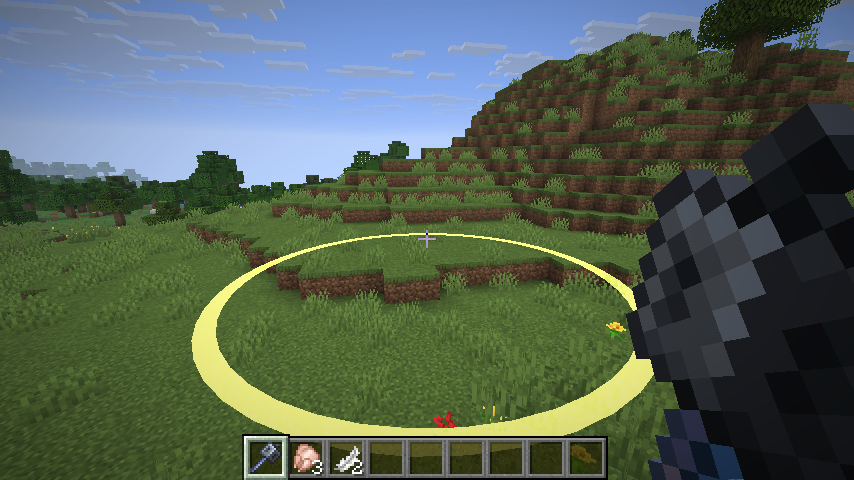
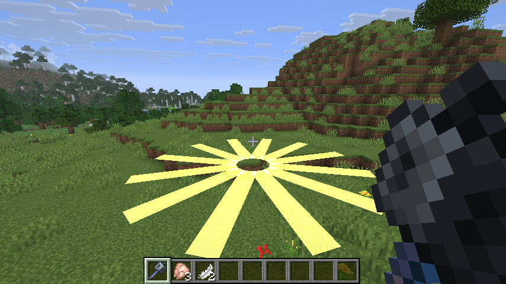
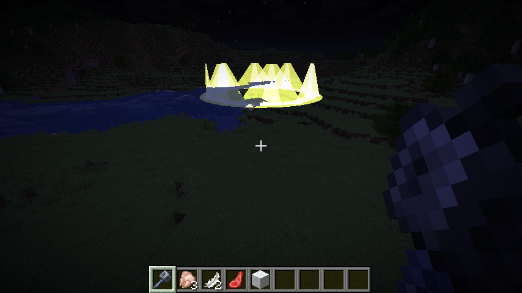
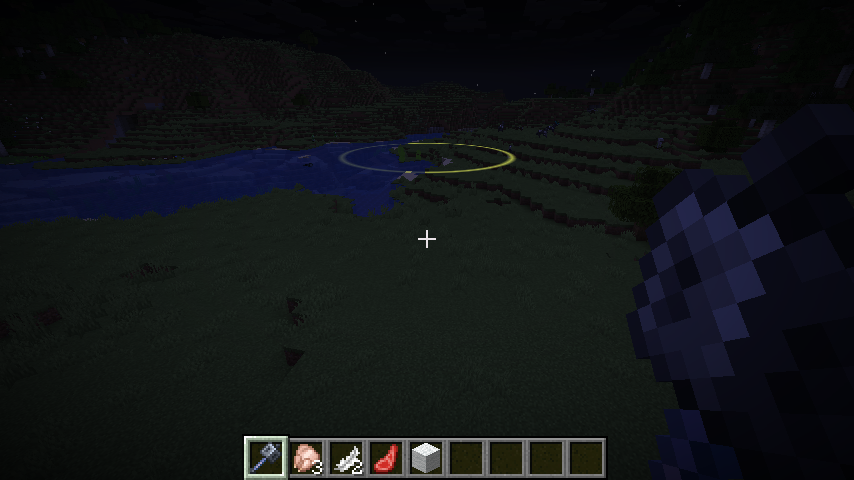
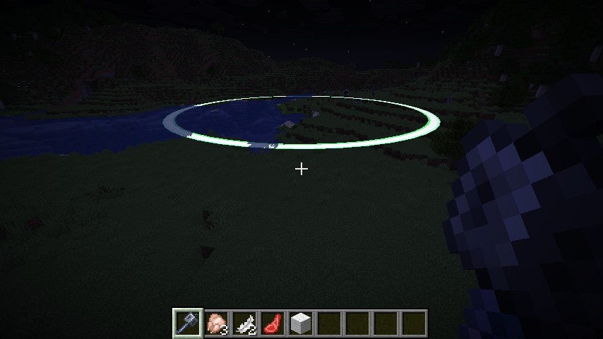

# PopEffects

[](https://github.com/Sercigamer/popeffects/actions/workflows/build.yml)

Clientseitige Fabric-Mod für **Minecraft 1.21.11**. Poppt jemand ein Totem,
frisst einen harten Treffer oder geht zu Boden, legt PopEffects einen
leuchtenden Effekt um ihn herum — und zwar genau den, den du dir eingestellt
hast.

Gedacht als das, was MassEffects sein wollte: dieselbe Idee, aber jeder
einzelne Auslöser hat seinen eigenen Stil, seine eigenen Farben, seine eigene
Größe, seinen eigenen Sound. Alles im Spiel einstellbar, mit Vorschau.

- Läuft **nur bei dir**. Der Server merkt nichts davon, Mitspieler sehen nichts.
- Keine neuen Shader-Dateien, keine Texturen — die Effekte werden zur Laufzeit
  aus Geometrie gebaut.
- Getestet mit Fabric und **Lunar Client**.

---

## Inhalt

- [Installation](#installation)
- [Erste Schritte](#erste-schritte)
- [Die vier Auslöser](#die-vier-auslöser)
- [Die neun Stile](#die-neun-stile)
- [Alle Einstellungen](#alle-einstellungen)
- [Tastenbelegung](#tastenbelegung)
- [Befehle](#befehle)
- [Die Config-Datei](#die-config-datei)
- [Wie der Schaden gemessen wird](#wie-der-schaden-gemessen-wird)
- [Leistung](#leistung)
- [Selbst bauen](#selbst-bauen)
- [Lizenz](#lizenz)

---

## Installation

### Normales Fabric

1. [Fabric Loader](https://fabricmc.net/use/installer/) für **1.21.11** installieren.
2. [Fabric API](https://modrinth.com/mod/fabric-api) für 1.21.11 in den
   `mods`-Ordner legen. **Ohne sie startet die Mod nicht.**
3. `popeffects-1.3.1.jar` daneben legen.
4. Optional: [Mod Menu](https://modrinth.com/mod/modmenu) — dann gibt es im
   Mod-Menü einen Zahnrad-Knopf zu PopEffects.

Den `mods`-Ordner findest du über den Startbildschirm des Minecraft-Launchers
oder unter `%APPDATA%\.minecraft\mods`.

### Lunar Client

Lunar Client kann Fabric-Mods laden, braucht dafür aber die **Fabric**-Variante
der Mod — die hier also, keine Forge-Version.

1. Lunar-Client-Launcher öffnen.
2. Links die Version **1.21.11** auswählen.
3. Unten rechts auf *Einstellungen*, oben den Reiter **Mods** wählen.
4. `popeffects-1.3.1.jar` **und** `fabric-api-....jar` in das Fenster ziehen.
   Über den 📁-Knopf kommst du direkt in den Ordner, falls du lieber kopierst.
5. Lunar Client neu starten.

Nimm möglichst den Mods-Knopf im Launcher statt selbst Ordner zu suchen — dann
landen die Dateien garantiert am richtigen Platz.

---

## Erste Schritte

| Was | Wie |
| --- | --- |
| Menü öffnen | Taste `P` |
| Effekt sofort sehen | Im Menü einen Effekt öffnen → **Vorschau** |
| Ohne Menü ausprobieren | `/pe totem preview` |
| Farbe ändern | `/pe totem color start #55FFFF` |
| Form ändern | `/pe kill style sphere` |
| Alles zurücksetzen | `/pe reset` |

Der Vorschau-Knopf setzt den Effekt **sieben Blöcke vor dich** in die Welt. Du
siehst jede Änderung sofort, ohne erst jemanden verprügeln zu müssen. Das Menü
pausiert das Spiel absichtlich nicht, damit die Animation auch im
Einzelspieler durchläuft.

---

## Die vier Auslöser

Jeder ist einzeln an- und abschaltbar und **komplett getrennt einstellbar**.

| Auslöser | Wann er feuert | Voreinstellung |
| --- | --- | --- |
| **Totem-Pop** | Jemand verbraucht ein Totem der Unsterblichkeit | Goldene Schockwelle mit drei Ringen, Beacon-Sound |
| **Großer Schaden** | Ein Lebewesen verliert auf einen Schlag genug Leben | Roter Ring, Schwelle 6 Schaden, ohne Sound |
| **Kill** | Ein Lebewesen stirbt | Violette Kuppel, bleibt an der Todesstelle liegen |
| **Eigener Schaden** | Du selbst kassierst einen harten Treffer | Rote Säule um dich — **standardmäßig aus** |

Dazu kommen globale Filter: Effekte an dir selbst, an anderen Spielern und an
Mobs lassen sich getrennt abschalten. Mit **Nur eigene Treffer** erscheinen
Schadens-Effekte ausschließlich bei Gegnern, die *du* getroffen hast.

---

## Die neun Stile

| Stil | Aussehen |
| --- | --- |
| `ring` | Ein flacher Ring am Boden, der nach außen läuft |
| `shockwave` | Mehrere Ringe hintereinander — der Klassiker |
| `disc` | Gefüllte Scheibe, die nach außen ausblendet |
| `dome` | Halbkugel aus Ringen über dem Kopf |
| `sphere` | Volle Kugel aus waagerechten Ringen |
| `pillar` | Senkrechter Zylinder um das Ziel |
| `helix` | Spirale, die nach oben läuft |
| `burst` | Strahlen, die sternförmig nach außen schießen |
| `crown` | Ein Kranz aus stehenden Zacken, der nach außen läuft |

Ringe werden mit weichen Kanten gezeichnet: innen und außen läuft die Farbe
auf null aus. Auf Wunsch legt sich zusätzlich ein breiter, blasser **Schein**
dahinter — das ergibt den Neonlook, macht die Form aber dicker.

| `ring` | `burst` | `crown` |
| --- | --- | --- |
|  |  |  |

---

## Alle Einstellungen

Das Menü hat pro Effekt vier Reiter, jeder mit einem klaren Thema.

### Reiter „Form"

| Einstellung | Bedeutung |
| --- | --- |
| Stil | Eine der neun Formen |
| Startradius / Endradius | Der Effekt wächst von einem zum anderen |
| Dicke | Breite der Bänder in Blöcken |
| Höhe | Für Kuppel, Kugel, Säule und Spirale |
| Höhenversatz | Verschiebung nach oben, gemessen ab den Füßen |
| Ecken | Auflösung der Ringe — mehr ist runder, aber teurer |
| Ringe | Anzahl Ringe bei Schockwelle, Kuppel und Kugel; bei der Spirale die Windungen |
| Drehung | Grad pro Sekunde, negativ dreht andersherum |
| Folgt dem Ziel | An: der Effekt wandert mit. Aus: er bleibt liegen |

### Reiter „Farbe"

| Einstellung | Bedeutung |
| --- | --- |
| Startfarbe / Endfarbe | Je drei Regler für Rot, Grün, Blau, mit Hex-Anzeige |
| Farbverlauf | Blendet über die Lebensdauer von der Start- zur Endfarbe |
| Regenbogen | Ignoriert beide Farben und dreht den Farbkreis durch |
| Deckkraft | 10 bis 255 |
| Leuchten | Additives Mischen — kräftiger, aber die Deckkraft steuert dann Helligkeit statt Durchsichtigkeit. **Standardmäßig aus** |
| Schein | Breiter, blasser Halo hinter der Form. Macht die Form sichtbar dicker, deshalb **standardmäßig aus** |
| Durch Wände | Der Effekt bleibt auch hinter Blöcken sichtbar |

**Leuchten** und **Schein** sind bewusst aus: beide arbeiten gegen ein sauberes
Ausblenden. Additiv addiert Licht auf den Hintergrund, statt ihn zu überdecken —
eine helle Farbe blüht dann auf und wirkt breiter, als sie ist. Der Schein legt
zusätzlich eine mehrfach breitere Kopie darunter. Ohne beides bleibt der Ring
eine dünne Linie, die über die eingestellte Zeit einfach durchsichtig wird. Wer
den Neonlook will, schaltet sie einzeln dazu.

### Reiter „Ablauf"

| Einstellung | Bedeutung |
| --- | --- |
| Effekt | Diesen Auslöser an- oder abschalten |
| Dauer | Lebensdauer in Ticks (20 Ticks = 1 Sekunde) |
| Einblenden | So viele Ticks am Anfang wird aufgeblendet. 0 = sofort voll da |
| Ausblenden | So viele Ticks am Ende wird ausgeblendet. 0 = harter Schnitt |
| Nachdehnen | Wie viele Blöcke der Effekt beim Verblassen noch nach außen läuft |
| Schwelle | Ab wie viel Schaden ausgelöst wird (nur bei den Schadens-Effekten) |
| Größe je Schaden | Ein harter Treffer erzeugt einen größeren Effekt, bis zum Dreifachen |

Ein- und Ausblenden zählen in **Ticks, nicht in Prozent**. Stellst du die Dauer
länger, bleibt das Ausblenden also genau so lang wie vorher — der Effekt steht
dann einfach länger, bevor er weggeht.

**Nachdehnen** ist das, was den Abgang sauber macht: der Effekt läuft während
des Verblassens weiter nach außen und wird dabei dünner. Er löst sich also auf,
statt auf den letzten Prozent stehenzubleiben und dann einfach weg zu sein.

| kurz nach dem Pop | kurz vor Schluss |
| --- | --- |
|  |  |

Derselbe Ring, einmal sechs und einmal zwanzig Ticks nach dem Auslösen: deutlich
weiter außen, dünner, zur Endfarbe gewandert — und durchsichtig genug, dass man
den Boden hindurch sieht. Die Deckkraft läuft dabei gleichmäßig auf null, der
Effekt ist also am Ende der eingestellten Zeit exakt unsichtbar.

### Reiter „Ton"

| Einstellung | Bedeutung |
| --- | --- |
| Sound abspielen, Klang, Lautstärke, Tonhöhe | Acht Vorschläge; eigene IDs gehen über die Config-Datei |
| Partikel, Partikelart, Partikelanzahl | Vanilla-Partikel im Kreis um den Effekt |

Im Hauptmenü stehen zusätzlich **Reichweite** (wie weit weg Effekte noch
gezeigt werden) und **Max. Effekte** (Notbremse gegen Effekt-Spam in großen
Kämpfen — läuft das Limit voll, fliegt der älteste Effekt raus).

---

## Tastenbelegung

| Taste | Funktion |
| --- | --- |
| `P` | PopEffects-Menü öffnen |
| *frei belegbar* | PopEffects komplett an/aus |
| *frei belegbar* | Vorschau des Totem-Effekts |

Alle drei stehen unter **Optionen → Steuerung → Tastenbelegung → Sonstiges**
und lassen sich frei ändern. Die beiden unteren sind absichtlich unbelegt,
damit die Mod dir keine Taste wegnimmt.

---

## Befehle

`/popeffects`, kurz `/pe`. Läuft komplett clientseitig.

| Befehl | Wirkung |
| --- | --- |
| `/pe` | Kurzer Statusbericht |
| `/pe config` | Menü öffnen |
| `/pe help` | Alle Befehle auflisten |
| `/pe on` · `/pe off` | Mod an- und ausschalten |
| `/pe reset` | Alles auf Werkseinstellungen |

Dazu für jeden Effekt ein eigener Unterbaum. `<effekt>` ist `totem`, `damage`,
`kill` oder `self`:

| Befehl | Wirkung |
| --- | --- |
| `/pe <effekt>` | Status dieses Effekts |
| `/pe <effekt> on` · `off` | Nur diesen Effekt schalten |
| `/pe <effekt> preview` | Effekt vor dir abspielen |
| `/pe <effekt> style <stil>` | Form wählen |
| `/pe <effekt> color start <#RRGGBB>` | Startfarbe |
| `/pe <effekt> color end <#RRGGBB>` | Endfarbe |
| `/pe <effekt> duration <ticks>` | Lebensdauer |
| `/pe <effekt> fadein <ticks>` | Einblendzeit |
| `/pe <effekt> fadeout <ticks>` | Ausblendzeit |
| `/pe <effekt> radius <blöcke>` | Endradius |
| `/pe <effekt> threshold <schaden>` | Ab wann er auslöst |
| `/pe <effekt> reset` | Nur diesen Effekt zurücksetzen |

---

## Die Config-Datei

Alles landet in `config/popeffects.json` — lesbar formatiert und nach Themen
sortiert (erst was, dann Farbe, dann Zeit, dann Größe, zuletzt Ton), damit man
Einstellungen auch von Hand ändern oder mit Freunden tauschen kann. Farben
stehen als Hex-Code drin, genau wie im Menü:

```json
"colorStart": "#FFD54A",
"colorEnd": "#37D67A",
"durationTicks": 28,
"fadeInTicks": 2,
"fadeOutTicks": 18,
```

Ältere Dateien aus Version 1.0.0 werden beim ersten Start automatisch
umgeschrieben — dort standen Farben noch als Dezimalzahl (`16766282`). Deine
Einstellungen bleiben dabei erhalten.

Die Datei wird beim Laden geprüft: Werte außerhalb des sinnvollen Bereichs
werden zurechtgerückt, fehlende Blöcke mit den Voreinstellungen aufgefüllt.
Eine kaputte Datei kann das Spiel also nicht lahmlegen.

Sound- und Partikel-IDs sind freie Felder. Im Menü stehen je acht Vorschläge
zur Auswahl, in der Datei kannst du jede beliebige ID eintragen — auch die aus
einem Resourcepack. Partikel, die Zusatzdaten brauchen (Block-, Staub- oder
Item-Partikel), werden übersprungen und im Log vermerkt.

---

## Wie der Schaden gemessen wird

Der Server schickt keinen Schadenswert an den Client, nur den neuen
Lebensstand. PopEffects merkt sich deshalb direkt vor dem Einspielen eines
Datenpakets den alten Wert und zieht danach ab — die Differenz ist der
Schaden.

Wer zugeschlagen hat, steht im Schadens-Paket, das kurz davor ankommt. Beides
zusammen ergibt „wer hat wem wie viel gegeben" und macht die Option *Nur
eigene Treffer* möglich. Server, die dieses Paket nicht schicken, kennen also
keine Zuordnung — dann bleibt die Option besser aus.

Totem-Pops und Tode meldet der Server dagegen direkt als Entity-Status, das
ist zuverlässig.

Ein tödlicher Treffer zeigt nur den Kill-Effekt, nicht zusätzlich den
Schadens-Effekt.

---

## Leistung

Die Effekte bestehen aus einfachen farbigen Vierecken ohne Textur. Ein Ring mit
der Voreinstellung von 48 Ecken sind 96 Vierecke — das fällt neben einer
normalen Minecraft-Szene nicht ins Gewicht.

Trotzdem gibt es zwei Bremsen: **Reichweite** wirft weit entfernte Effekte
raus, **Max. Effekte** begrenzt, wie viele gleichzeitig laufen. Wer auf einem
schwachen Rechner spielt, dreht am ehesten *Ecken* herunter.

Gezeichnet wird in einem eigenen Render-Layer, der auf dem
Vanilla-Shader `core/position_color` aufbaut. Es kommen also keine eigenen
Shader-Dateien mit, die bei einem Minecraft-Update kaputtgehen könnten.

---

## Wenn nichts passiert

| Symptom | Ursache |
| --- | --- |
| Mod taucht nicht auf | **Fabric API** fehlt im `mods`-Ordner |
| Menü zeigt nur Kürzel wie `popeffects.edit.style` | Falsches Jar erwischt — im `mods`-Ordner darf nur `popeffects-x.y.z.jar` liegen, nicht das `-sources.jar` |
| Gar keine Effekte | `/pe status` — sind Mod und der jeweilige Effekt an? |
| Nur bei manchen Gegnern | Reichweite zu klein, oder *Nur eigene Treffer* ist an und der Server schickt keine Zuordnung |
| Effekt zu selten | Schwelle zu hoch: `/pe damage threshold 4` |
| Effekt verschwindet hinter Blöcken | *Durch Wände* einschalten |

Zum Prüfen der Grafik gibt es einen Selbsttest. Startest du mit
`-Dpopeffects.selftest=true`, spielt die Mod nach dem Betreten einer Welt
einmal jeden der neun Stile ab und legt von jedem zwei Screenshots in
`screenshots/` — praktisch nach einem Minecraft-Update.

---

## Selbst bauen

```bash
./gradlew build
```

Das fertige Jar liegt danach in `build/libs/`. Zum Ausprobieren:

```bash
./gradlew runClient
```

Gebraucht wird JDK 21 — fehlt es, lädt Gradle es selbst herunter.

Jeder Push baut über GitHub Actions; ein Tag wie `v1.0.0` erzeugt zusätzlich
ein Release samt Jar. Der Release-Text kommt aus dem passenden Abschnitt in
[CHANGELOG.md](CHANGELOG.md).

---

## Lizenz

[MIT](LICENSE)
